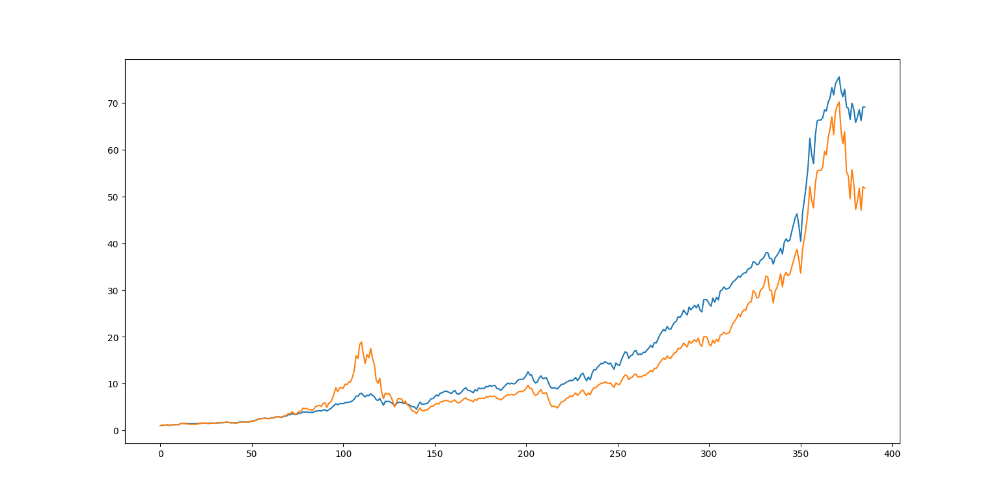

# 用估值法优化指数投资

## 计算方法

以标普500为例，计算每一期（月或者周）的估值：

估值=标普500市盈率*10年期美债收益率

计算当期的估值在历史样本中的百分位，当前估值越低，仓位越高，估值越高，仓位越低，以此来确定仓位。不过需要注意以下几点：

* 需要确定一个最低仓位，避免踏空
* 选择多少期历史数据作为样本
* 估值和仓位的关系

## 优化结果

用上述估值方法优化标普500 1982年1月~2023年2月的回报，无风险利率为3.65%。

|        | 最大回撤 | 夏普比率 | 年化收益 |
| ------ | -------- | -------- | -------- |
| 优化前 | 53%      | 0.42     | 8.93%    |
| 优化后 | 31%      | 0.57     | 9.63%    |

用上述估值方法优化纳斯达克100 1991年1月~2023年2月的回报，无风险利率为3.65%。

|        | 最大回撤 | 夏普比率 | 年化收益 |
| ------ | -------- | -------- | -------- |
| 优化前 | 81%      | 0.49     | 13.06%   |
| 优化后 | 43%      | 0.71     | 14.07%   |

